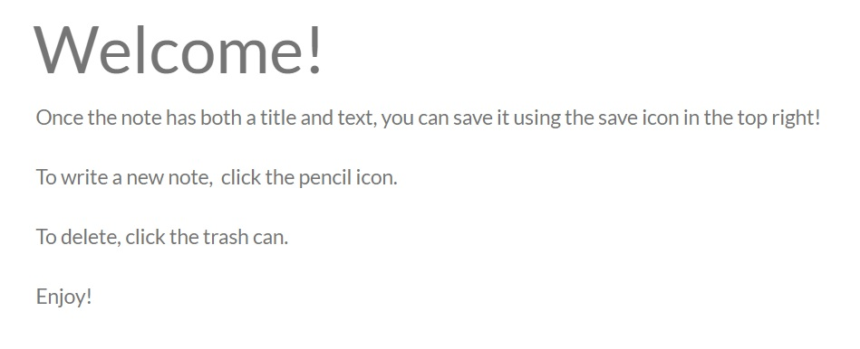

# note-taker-express

## description
[Test this app on heroku](https://mysterious-refuge-71345.herokuapp.com/)! It allows users to create, read, and delete notes. Instead of local storage, the notes are saved in a json file which is meant to simulate a database.

## installation
In order to use the app, there's no need for any installation.
You can test out this node app as [deployed on heroku](https://mysterious-refuge-71345.herokuapp.com/), but if you want to use it locally, first make sure you have node installed. After that, getting things up and running is as simple as typing `npm install` into your terminal which installs express since it's marked as a dependency in the package.json file.

## usage
This is not a CLI application, so you need to navigate to where the server is being hosted to use the app.

Once you click the 'Get Started' button on the landing page you'll be brought to where you can create, read, and delete notes. 

There's a welcome note that describes usage there, saying:

## final thoughts
Working on an application like this really demonstrates how to write code for a full-stack application. What this project also demonstrates is that there's a lot of things I know how to use, but don't fully understand. 

I'm going to play around more with code and try to create some more small-scale projects in order to understand both front and back-end features more so that I can be more efficient in my code!